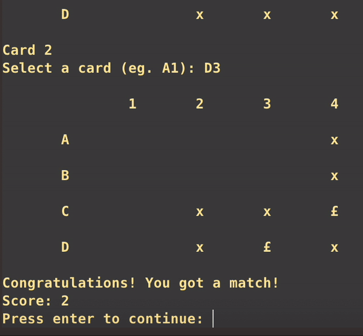

# Matching Cards

A 2-player command line card-matching memory game created as part of the 10.009 course in Spring 2020.

## Description

Get a friend and select between a 4x4 or 6x6 board. Take turns picking 2 cards and see whether they match. A match earns a player 1 point and another turn. The game ends when all cards have been opened.

## Code Design

This game was created with the intention of showcasing the use of a state machine and OOP. As such, the game logic code focuses significantly on the input, output and states in the game.

The game is also divided into 3 separate classes: Player, Board and MemoryGame.

- Player keeps track of the score and receives input from the physical player.
- Board handles the logic for card-related functions such as arranging and matching the cards.
- MemoryGame handles the game flow logic such as switching between players and ending the game.
